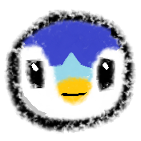

<h1 align="center">
  
  Nuzlocke Overlay
</h1>

<p align="center">
  <a href="https://twitch.tv/NoverrazTV" target="_blank">
    
  </a>
</p>

<p align="center">
  
  
  
  
</p>

<p align="center">
  A <strong>lightweight, standalone OBS Browser Source</strong> for displaying live <strong>Nuzlocke</strong> teams.<br>
  Supports <strong>Solo Nuzlocke</strong> (single player) and <strong>Soul Link</strong> (two players, linked pairs) runs.
</p>

---

## Overview

Whether you are running a **Solo Nuzlocke** on your own or a **Soul Link** with a friend, this overlay shows your Pokémon team live on stream. It works as a **Browser Source** in OBS. No plugins or extra software required.

Includes a **web-based setup page** where you can edit your team in-browser. Your data is saved in localStorage, so it persists when you come back. **Edit the text any time and the overlay updates live**, no need to refresh or restart OBS.

The site is hosted at **[nuzlocke-overlay.noverraz.tv](https://nuzlocke-overlay.noverraz.tv)**. Just visit, type your team out, and copy the overlay URL.

---

## Quick Start

Just visit the live site:

```
https://nuzlocke-overlay.noverraz.tv
```

1. The editor starts **empty** with a grey placeholder showing the format
2. Click **"Load Example"** to see sample data, or start typing your own team members
3. Your data auto-saves to localStorage, so you can come back anytime and it's still there
4. Click **"Copy Overlay URL"** and paste into OBS as a Browser Source

No server, no installation, everything runs in your browser.

---

## How It Works

1. Open the setup page at [nuzlocke-overlay.noverraz.tv](https://nuzlocke-overlay.noverraz.tv)
2. The editor starts **empty** with a grey placeholder showing the format. Click **"Load Example"** to see sample data, or start typing your own team
3. Your data auto-saves to localStorage on every keystroke, so you can come back anytime and it's still there
4. Click **"Copy Overlay URL"** to copy the link
5. Paste the link into OBS as a Browser Source

**Live editing:** While the overlay is open in OBS, you can go back to the setup page, edit the text, and the overlay will update automatically within a few seconds. No need to refresh the browser source.

---

## YAML Format

The overlay supports **two modes**, auto-detected per route:

#### Solo Nuzlocke Mode (one Pokemon per route)

```yaml
- Route 201
Nightfall
Piplup (Shiny)

- Route 202 (DEAD)
Kipstuk
Starly

- Lake Verity
Royalty
Starly
```

#### Soul Link Mode (two Pokemon per route)

```yaml
- Route 201
Nightfall & Daybreak
Piplup (Shiny) & Piplup

- Route 202 (DEAD)
Biefstuk & Kipstuk
Bidoof & Starly

- Lake Verity
Royalty & Tyranny
Starly & Bidoof
```

**Format rules:**
- **`- Route Name`:** Starts a new team member entry
- **Next line:** Nicknames: single nickname (Solo) or `Player1 & Player2` (Soul Link)
- **Next line:** Species: single species (Solo) or `Player1 & Player2` (Soul Link)
  - **Auto-detection:** If the species line contains `&`, it is Soul Link mode. Otherwise, it is Solo mode.
- **`(DEAD)` or `(BOX)`** on a route line hides that team member entry
- **`(Shiny)`** after a species shows shiny sprite for that Pokemon
- Blank lines are ignored

**Comments:** Lines starting with `#` are ignored:

```yaml
# This route is dead, keeping for reference
- Route 202 (DEAD)
Biefstuk & Kipstuk
Bidoof & Starly
```

**Mixed mode:** You can mix Solo and Soul Link routes in the same file. Each route is auto-detected independently.

---

## OBS Setup

Add a **Browser** source with:

| Setting | Value |
|---|---|
| URL | The URL you copied from the setup page |
| Width | Your stream canvas width (e.g. 1920) |
| Height | Your stream canvas height (e.g. 1080) |

---

## URL Parameters

| Param | Example | Effect |
|---|---|---|
| `?female=true` | `?female=true` | Shows female variant sprites |
| `?art=home` | `?art=home` | Uses PokeAPI "home" artwork instead of "official-artwork" |
| `?font=FontName` | `?font=Press+Start+2P` | Replace default font with any Google Font (spaces become `+`) |
| `?gen=1-5` | `?gen=1-5` | Use Gen 1-5 type assignments (e.g. Clefairy shows Normal instead of Fairy) |
| `?font-weight=...` | `?font=Rubik&font-weight=300;400;600;700` | Font weights to load (semicolon-separated, default `400;600;700`) |

### Generation-Aware Typing

Some Pokemon had their types changed in Generation 6 (e.g. Clefairy went from Normal to Fairy, Magnemite went from Electric to Electric/Steel). By default, the overlay uses **current (Gen 6+) typing** for the circle colors.

To use **pre-Gen-6 typing** instead, add `?gen=1-5` to your overlay URL. The overlay will look up the `past_types` data from PokeAPI and use the type assignment from Generations 1-5.

You can also select this from the **Typing** dropdown on the setup page (right of the "Load Example" button).

### Pokemon Name Normalization

The overlay automatically normalizes common name formats so you don't need to know PokeAPI's exact slug format:

| You type | PokeAPI expects |
|---|---|
| `Mr. Mime` | `mr-mime` |
| `Galarian Mr. Mime` | `mr-mime-galar` |
| `Alolan Raichu` | `raichu-alola` |
| `Hisuian Zorua` | `zorua-hisui` |
| `Paldean Wooper` | `wooper-paldea` |
| `Farfetch'd` | `farfetchd` |
| `Flabébé` | `flabebe` |
| `Type: Null` | `type-null` |
| `Nidoran♀` | `nidoran-f` |

Just type the name naturally and the overlay should handle the conversion.

### Font Customization

The overlay uses **FLURO** by default, but you can swap to any Google Font:

```
?font=Press+Start+2P
?font=Rubik&font-weight=300;400;600;700
?font=Montserrat&font-weight=400;700
```

The font is loaded dynamically via the Google Fonts CSS2 API. FLURO is always kept as a fallback.

---

## Project Structure

```
nuzlocke-overlay/
├── public/
│   ├── index.html       Setup page (YAML editor, URL generator)
│   ├── overlay.html     OBS Browser Source (the overlay)
│   ├── run.yaml         Fallback team data for local dev
│   ├── fonts/           FLURO font files
│   └── favicon/         Site icons
├── server.js            Static file server (Node.js, zero deps)
├── package.json
├── .gitignore
└── README.md
```

---

## License

<p align="center">
  
  
</p>

[MIT](LICENSE)

Copyright (c) 2025 Luuk Noverraz
